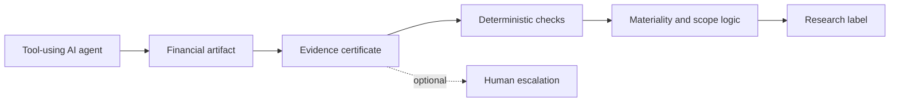

# Research map: paper concepts to public code

This map keeps the public code companion's scope explicit. The examples are
synthetic and exercise deterministic logic; they are not the archival paper's
empirical dataset.

| Paper concept | Public code object | Synthetic evidence | Not reproduced here | Future extension |
|---|---|---|---|---|
| Four research labels | `core.evaluate_artifact` and `schema.ResearchLabel` | `examples/clean_case.json`, `qualified_formula_error.json`, `adverse_multiple_errors.json`, `disclaimer_missing_evidence.json` | SEC-backed case sampling and expert study | Publicly redistributable case set after provenance review |
| Evidence sufficiency and provenance | `core.check_claims` and `schema.Claim` | Claim/entity/period/metric alignment cases | Full paper certificate/checker field grid | Richer evidence lineage adapters |
| Materiality and pervasiveness | `core.assess_materiality` and `core.aggregate_label` | Numeric/qualitative severity and multiple-issue examples | Threshold-sensitivity grid and domain calibration | Domain-specific materiality profiles |
| Formula checks and critical matters | `core.check_formula` and `core.select_critical_matters` | Formula-error case and prioritization fields | Expert toll / broad reviewer protocol | Selective escalation policy experiments |
| False-clean risk | `core.false_clean_rate` | Deterministic helper test and report | 400-case diagnostic conclusions | Larger public-safe evaluation once licensed |
| Action trace | `trace.check_action_trace` | `examples/trace_gap_case.json` with human-review trigger | Upstream action logs from the accepted paper | Evidence-aware tool-call and human-escalation research |

## Architecture

The action-trace path is a **prospective extension**, not an HCOMP 2026
accepted-paper result. See [`TRACE_EXTENSION.md`](TRACE_EXTENSION.md) and
[`NON_CLAIMS.md`](NON_CLAIMS.md) for boundaries.
